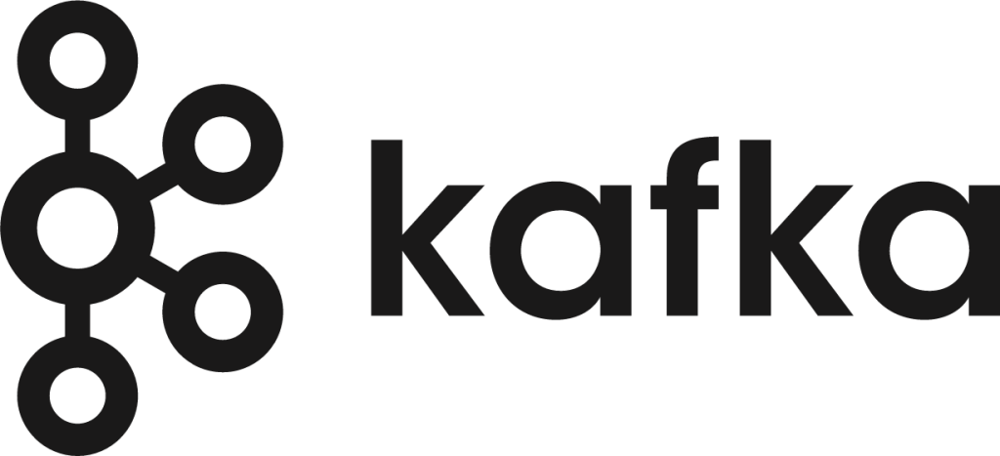

  

<h1 align="center">Awesome Kafka</h1>

  
   

  A curated list of awesome Apache Kafka frameworks, libraries, software, and resources.

---

## Table of Contents

- [Introduction](#introduction)
- [Official Resources](#official-resources)
- [Books](#books)
- [Tutorials & Courses](#tutorials--courses)
- [Tools](#tools)
- [Libraries](#libraries)
- [Extensions](#extensions)
- [Integrations](#integrations)
- [Projects Using Kafka](#projects-using-kafka)
- [Blogs and Articles](#blogs-and-articles)
- [Conferences & Meetups](#conferences--meetups)
- [Community](#community)
- [Contributing](#contributing)

---

## Introduction

- [What is Apache Kafka?](https://kafka.apache.org/intro)
- [Kafka Documentation](https://kafka.apache.org/documentation/)

---

## Official Resources

- [Kafka GitHub](https://github.com/apache/kafka)
- [Kafka JIRA](https://issues.apache.org/jira/projects/KAFKA/summary)

---

## Books

- "Kafka: The Definitive Guide" by Neha Narkhede, Gwen Shapira, and Todd Palino.
- "Streaming Systems" by Tyler Akidau, Slava Chernyak, and Reuven Lax.
- "Mastering Kafka Streams and ksqlDB" by Mitch Seymour.

---

## Tutorials & Courses

- [Confluent Kafka Tutorials](https://www.confluent.io/blog/apache-kafka-tutorial/)
- [Udemy: Learn Apache Kafka for Beginners v3](https://www.udemy.com/course/apache-kafka)

---

## Tools

- [Kafdrop](https://github.com/obsidiandynamics/kafdrop) - Web UI for viewing Kafka topics and browsing consumer groups.
- [Kafka Tool](http://www.kafkatool.com/) - GUI application for managing and using Apache Kafka clusters.

---

## Libraries

### .NET

- [Confluent's .NET Client for Apache Kafka](https://github.com/confluentinc/confluent-kafka-dotnet)

### Java

- [Confluent's Java Client for Apache Kafka](https://github.com/confluentinc/confluent-kafka-java)

### Go

- [Confluent's Go Client for Apache Kafka](https://github.com/confluentinc/confluent-kafka-go)
- [Sarama - Go client library for Apache Kafka](https://github.com/Shopify/sarama)
- [franz-go - A modern Kafka client for Go](https://github.com/twmb/franz-go)

### Python

- [Confluent's Python Client for Apache Kafka](https://github.com/confluentinc/confluent-kafka-python)
- [kafka-python - Pure Python client for Apache Kafka](https://github.com/dpkp/kafka-python)

### Node.js

- [KafkaJS - Kafka client for Node.js](https://github.com/tulios/kafkajs)

### Rust

- [kafka-rust - Rust client for Apache Kafka](https://github.com/spicavigo/kafka-rust)

### Ruby

- [ruby-kafka - Ruby client for Apache Kafka](https://github.com/zendesk/ruby-kafka)

### C

- [librdkafka - C library for Apache Kafka](https://github.com/edenhill/librdkafka)

---

## Extensions

- [Kafka Connect](https://kafka.apache.org/documentation/#connect)
- [Kafka Streams](https://kafka.apache.org/documentation/streams/)

---

## Integrations

- [Debezium - CDC with Kafka](https://debezium.io/)
- [Kafka Connect JDBC Connector](https://www.confluent.io/hub/confluentinc/kafka-connect-jdbc)

---

## Projects Using Kafka

- [Pinot (Real-time distributed OLAP datastore)](https://pinot.apache.org/)
- [ProjectX](#)

---

## Blogs and Articles

- [Confluent Blog](https://www.confluent.io/blog/)
- [Jack Vanlightly's Kafka and RabbitMQ Comparisons](https://jack-vanlightly.com/)

---

## Conferences & Meetups

- [Kafka Summit](https://kafka-summit.org/)
- [Meetup.com Kafka Groups](https://www.meetup.com/topics/apache-kafka/)

---

## Community

- [Kafka Mailing Lists](https://kafka.apache.org/contact)
- [Kafka Slack](https://slackpass.io/confluentcommunity)
- [Kafka Stack Overflow](https://stackoverflow.com/questions/tagged/kafka)

---

## Contributing

Contributions are welcome! Please read the [contribution guidelines](CONTRIBUTING.md) first.